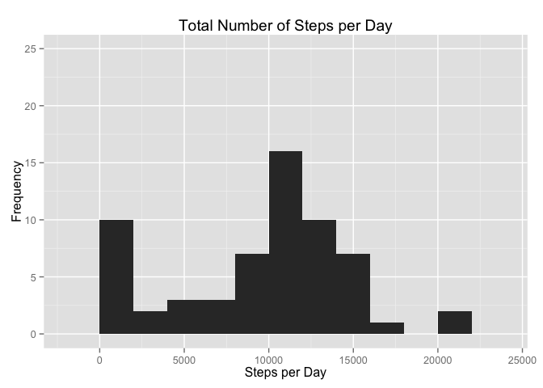
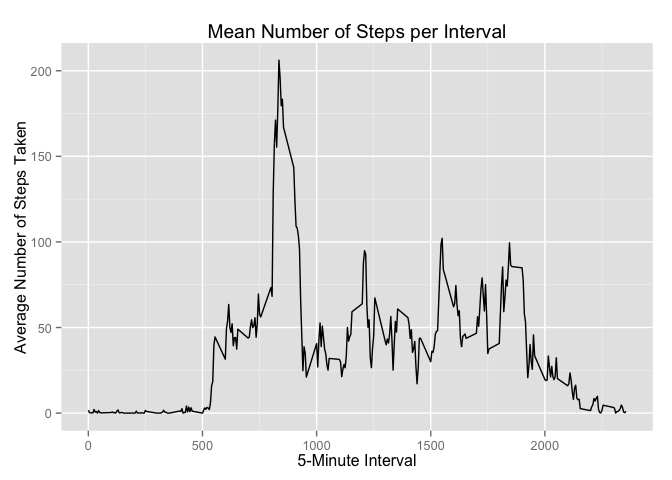
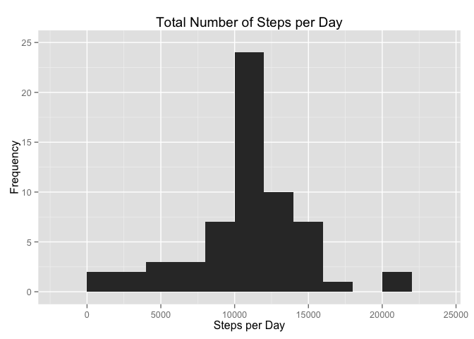
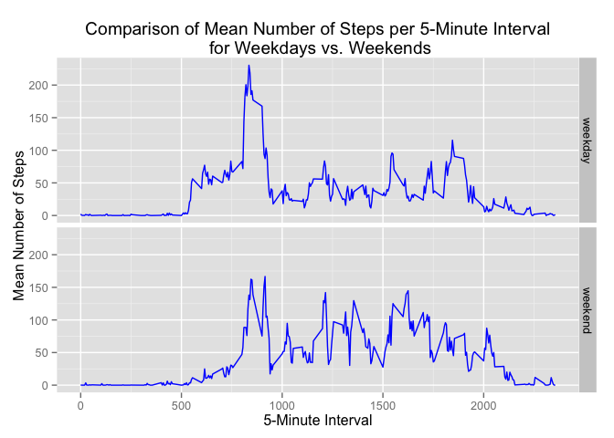

# Reproducible Research: Peer Assessment 1
### kmborchert 
### June 9, 2014
### PAI_template.Rmd

## Overview
This document outlines the steps taken to import, display and analyze data from a 
personal activity monitoring device. As stated in the class assignment, the monitoring device 
"collects data at 5 minute intervals through out the day. The data consists of two 
months of data from an anonymous individual collected during the months of October 
and November, 2012 and include the number of steps taken in 5 minute intervals each 
day."  This document outlines the steps used to load and preprocess the data, calculate
mean steps taken per day, plot the average daily activity pattern, and fill in missing 
values. Finally, a plot is constructed in an attempt to answer the question of whether 
there are differences in activity patterns bewteen weekdays and weekends. 

## Packages required
The following R packages are required:

```r
library(plyr)
library(knitr)
library(ggplot2)
```


```r
# Set knitr options to save plots to figures subfolder
opts_chunk$set(fig.path = "figure/")
```


## Loading and preprocessing the data
In this step, the file called "activity.zip" is unzipped and the file "activity.csv"
is extracted and read into a data frame called "data".  In the same step, the classes 
for steps, date and interval columns are changed.  The date column goes to date format 
(instead of character), and steps and interval columns go to numeric (from integer).


```r
# Set working directory: setwd('~/Documents/Reproducible
# Research/RepData_PeerAssessment1')
data <- read.csv(unzip("activity.zip", "activity.csv"), header = TRUE, sep = ",", 
    stringsAsFactors = FALSE, na.strings = "NA", colClasses = c("numeric", "Date", 
        "numeric"))
```


## What is mean total number of steps taken per day?
Here, the total number of steps per day is calculated using summarize (and sum) 
in plyr to condense the data down across the intervals by date.  qplot is than used 
to create a histogram showing the distribution.  Finally, the mean and median for 
total steps per day is calculated.

```r
# Sum up all steps by date
data.sums <- ddply(data, .(date), summarize, steps = sum(steps, na.rm = TRUE))
# Make histogram
qplot(data.sums$steps, geom = "histogram", main = "Total Number of Steps per Day", 
    xlab = "Steps per Day", ylab = "Frequency", binwidth = 2000, ylim = c(0, 
        25))
```

 

```r
mean1 <- mean(data.sums$steps)
mean1
```

```
## [1] 9354
```

```r
median1 <- median(data.sums$steps)
median1
```

```
## [1] 10395
```


## What is the average daily activity pattern?
In this section a time series plot is created which plots the average number of 
steps per interval averaged across all days (there are 288 intervals in one day).
Then, the interval containing the highest average number of steps is identified.  

Going back to the original data ("data"), ddply is used to summarize (mean) across 
each 5-minute interval.  Then qplot is used to plot the mean steps.

```r
# Calculate the mean for each interval across all dates
data.interval <- ddply(data, .(interval), summarize, steps = mean(steps, na.rm = TRUE))

qplot(interval, steps, data = data.interval, geom = "line", main = "Mean Number of Steps per Interval", 
    xlab = "5-Minute Interval", ylab = "Average Number of Steps Taken")
```

 


Now the interval (1-288) containing the highest number of average steps is identified.
For this step, which.max is used to find the maximum value of "data.interval" dataframe's
"steps" column (created above).


```r
max <- data.interval[which.max(data.interval$steps), ]
max
```

```
##     interval steps
## 104      835 206.2
```


## Imputing missing values

This dataset contained a large number of missing values.  In this section, the number
of rows containing NA's is computed, then the NAs are replaced with the mean for a given
interval (calculated above).  Finally, a new histogram is created with the filled data
and mean and median's are compared to the original data (NAs excluded).  
The code below summarizes the total number of NAs from the original dataset
("data" dataframe), broken out by column.


```r
# IDs number of NAs by each column
NA.report <- rbind(names(data), as.numeric(colSums(is.na(data))))
NA.report
```

```
##      [,1]    [,2]   [,3]      
## [1,] "steps" "date" "interval"
## [2,] "2304"  "0"    "0"
```

From the report above, all NAs (n=2304) appear to be in the steps columns.

To fill in the missing values, all NA values will be set to the mean for that interval
across all days.  A "for"" loop is used for this.  The new dataframe is called 
"filled.data". The "check" matrix at the end shows whether missing values are still present.


```r
# 'for' loop replaces NA values with the mean for that interval, calcuated
# in the data.interval dataframe.
fillNA <- function(steps, interval) {
    filled <- NA
    if (!is.na(steps)) 
        filled <- c(steps) else filled <- (data.interval[data.interval$interval == interval, "steps"])
    return(filled)
}
filled.data <- data
filled.data$steps <- mapply(fillNA, filled.data$steps, filled.data$interval)

# This steps checks to make sure NAs were removed.
check <- rbind(names(filled.data), as.numeric(colSums(is.na(filled.data))))
check
```

```
##      [,1]    [,2]   [,3]      
## [1,] "steps" "date" "interval"
## [2,] "0"     "0"    "0"
```


In this section, a histogram of the total number of steps taken per day is constructed,
this time using the data where NA values were replaced with the interval mean ("filled.data"
dataframe).  
This re-uses the histogram code used above, this time using the "filled.data" dataframe. 
The mean and median are also calculated so that the values can be compared to the 
previous results where NA values were excluded ("data.sums" dataframe).


```r
filled.sums <- ddply(filled.data, .(date), summarize, steps = sum(steps, na.rm = FALSE))
qplot(filled.sums$steps, geom = "histogram", main = "Total Number of Steps per Day", 
    xlab = "Steps per Day", ylab = "Frequency", binwidth = 2000, ylim = c(0, 
        25))
```

 

```r
mean2 <- mean(filled.sums$steps)
mean2
```

```
## [1] 10766
```

```r
median2 <- median(filled.sums$steps)
median2
```

```
## [1] 10766
```

```r

# Comparing mean1 to mean2 and median1 to median2
mean1
```

```
## [1] 9354
```

```r
mean2
```

```
## [1] 10766
```

```r
median1
```

```
## [1] 10395
```

```r
median2
```

```
## [1] 10766
```


With the filled data, the mean was higher than in the previous section where NA
values were excluded (10766.19 compared to 9354.23).  The median was also higher 
in the filled data compared to the NA-excluded data, but was less impacted by the 
filling (10766.19 compared to 10395).  

## Are there differences in activity patterns between weekdays and weekends?

In this section the weekdays function is used in combination with a "for" loop to
categorize each day of the week (extracted from the date column) as either a weekday
or a weekend.  A time series plot is then created to compare the average steps per
5-minute interval for weekdays compared to weekends.

```r
# for loop: M-F labelled weekdays, Sat & Sun labelled weekends
day.cat <- function(date) {
    day <- weekdays(date)
    if (day %in% c("Monday", "Tuesday", "Wednesday", "Thursday", "Friday")) 
        return("weekday") else if (day %in% c("Saturday", "Sunday")) 
        return("weekend") else stop("invalid date")
}
filled.data$daytype <- sapply(filled.data$date, FUN = day.cat)
```


In this section, the average of each 5-minute interval is calculated across either 
weekdays or weekend days.  ggplot is then used to plot the comparison in mean number
of steps per five minute interval between weekends and weekdays.

```r
# aggregate is used to take the mean by interval and daytype (weekday or
# weekend)
daytype.mean <- aggregate(steps ~ interval + daytype, data = filled.data, FUN = "mean")
# a line plot is created in ggplot
ggplot(daytype.mean, aes(interval, steps)) + geom_line(colour = "blue") + facet_grid(daytype ~ 
    .) + labs(title = "Comparison of Mean Number of Steps per 5-Minute Interval\n for Weekdays vs. Weekends") + 
    xlab("5-Minute Interval") + ylab("Mean Number of Steps")
```

 

```r

# max.daytype <- daytype.mean[which.max(daytype.mean$steps),] max.daytype
```


Although the activity profiles show similar peaks in activity across the intervals,
peak activity appears to go higher during weekdays.  This is confirmed when one looks
at the maximum average number of steps occurs


```r
max.daytype <- daytype.mean[which.max(daytype.mean$steps), ]
max.daytype
```

```
##     interval daytype steps
## 104      835 weekday 230.4
```


